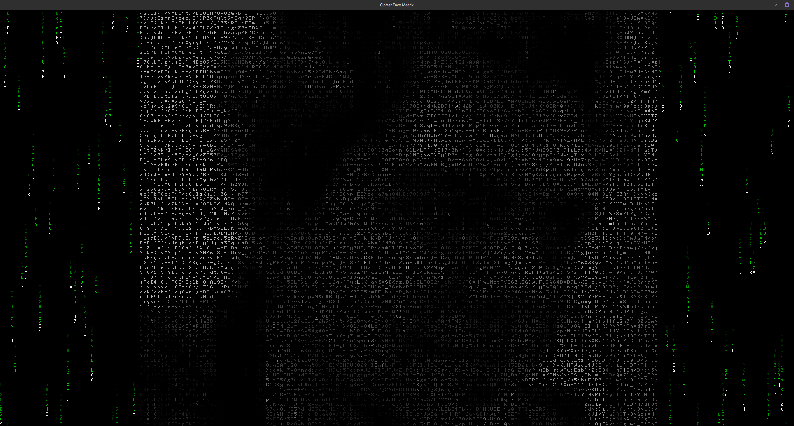

# glmatrix-face

An example C program that demonstrates _Text Mosaic Mapping_ with `OpenGL/GLUT` for _ASCII_-like image terminal art and animated _matrix_-like scrolling cipher code.

Do not confuse this project with the official `glmatrix` Xscreensaver. No affiliation.

Demo video:
https://www.youtube.com/watch?v=5DhFIHp6pqg

This version uses a _Grid State_ rendering engine, insted of drawing arbitrary floating coordinates, and manages a rigid 2D array of character cells (like a real terminal).
- Pixel mapping for every character cell
- Cipher blend (for every character overlapping face image)
- Shifts active text color from green to image color
- **Live Mutation**: Even when the face is fully visible, the characters making up the image are randomly re-rolling (`grid_chars[x][y] = 33 + (rand() % 94)`), giving the portrait a dynamic, crawling cipher effect.
- **Pixel interpolation** (crossfading) between images.

The name says it all :P

